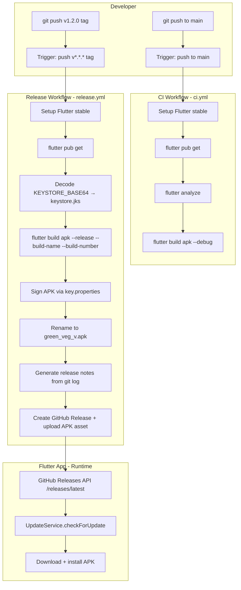

# Design Document: GitHub Release CI/CD

## Overview

This design covers two GitHub Actions workflows and the configuration changes needed to make the `green_veg_stock_management` Flutter app build, sign, release, and self-update automatically.

**CI workflow** — triggers on every push to `main`, runs analysis and a debug build to catch regressions early.

**Release workflow** — triggers on `v*.*.*` tags, builds a signed release APK, creates a GitHub Release with auto-generated release notes, and attaches the APK as an asset named `green_veg_v<version>.apk`.

**UpdateService configuration** — the two placeholder constants (`_githubOwner`, `_githubRepo`) are filled in so the existing in-app update check resolves to the correct GitHub Releases API endpoint.

The design intentionally keeps the Android signing config inside the workflow (via environment variables injected at build time) rather than committing keystore files or credentials to the repository.


## Architecture



### Key design decisions

- **Signing via `key.properties`**: The workflow writes a `key.properties` file at build time from secrets, and `build.gradle.kts` reads it. This is the standard Flutter/Android pattern and avoids hardcoding credentials.
- **Build number = `GITHUB_RUN_NUMBER`**: Monotonically increasing, free, and requires no extra tooling.
- **Release notes from `git log`**: `git log <prev_tag>..HEAD --pretty=format:"- %s"` gives a clean changelog without extra dependencies.
- **Single APK asset per release**: The `UpdateService` uses `assets.firstWhereOrNull(a => a['name'].endsWith('.apk'))`, so exactly one `.apk` must be attached.
- **`subosito/flutter-action` with `cache: true`**: Built-in pub cache support; no manual cache step needed.


## Components and Interfaces

### 1. `.github/workflows/ci.yml`

Triggered by `push` to `main`. Steps:

| Step | Action / Command |
|------|-----------------|
| Checkout | `actions/checkout@v4` |
| Flutter setup | `subosito/flutter-action@v2` — channel `stable`, `cache: true` |
| Dependencies | `flutter pub get` |
| Analyze | `flutter analyze` (fails workflow on any error) |
| Debug build | `flutter build apk --debug` |

No secrets required.

### 2. `.github/workflows/release.yml`

Triggered by `push` with tag pattern `v*.*.*`. Steps:

| Step | Action / Command |
|------|-----------------|
| Checkout (full history) | `actions/checkout@v4` with `fetch-depth: 0` |
| Flutter setup | `subosito/flutter-action@v2` — channel `stable`, `cache: true` |
| Dependencies | `flutter pub get` |
| Decode keystore | `echo "$KEYSTORE_BASE64" \| base64 -d > android/app/keystore.jks` |
| Write key.properties | Write `KEY_STORE_PASSWORD`, `KEY_ALIAS`, `KEY_PASSWORD`, `storeFile` path |
| Release build | `flutter build apk --release --build-name=$VERSION --build-number=${{ github.run_number }}` |
| Rename APK | `mv build/app/outputs/flutter-apk/app-release.apk green_veg_v$VERSION.apk` |
| Generate notes | `git log $(git describe --tags --abbrev=0 HEAD^)..HEAD --pretty=format:"- %s"` |
| Create release | `softprops/action-gh-release@v2` — tag, notes, APK asset |

Secrets consumed: `KEYSTORE_BASE64`, `KEY_STORE_PASSWORD`, `KEY_ALIAS`, `KEY_PASSWORD`.

### 3. `android/app/build.gradle.kts` (modified)

A `signingConfigs.release` block is added that reads from `key.properties` when the file exists, falling back to the debug config otherwise (so local dev still works):

```kotlin
import java.util.Properties

val keyPropertiesFile = rootProject.file("app/key.properties")
val keyProperties = Properties()
if (keyPropertiesFile.exists()) {
    keyProperties.load(keyPropertiesFile.inputStream())
}

android {
    signingConfigs {
        create("release") {
            if (keyPropertiesFile.exists()) {
                storeFile = file(keyProperties["storeFile"] as String)
                storePassword = keyProperties["storePassword"] as String
                keyAlias = keyProperties["keyAlias"] as String
                keyPassword = keyProperties["keyPassword"] as String
            }
        }
    }
    buildTypes {
        release {
            signingConfig = if (keyPropertiesFile.exists())
                signingConfigs.getByName("release")
            else
                signingConfigs.getByName("debug")
        }
    }
}
```

### 4. `lib/app/services/update_service.dart` (modified)

Only the two placeholder constants change:

```dart
static const String _githubOwner = '<actual-github-username>';
static const String _githubRepo  = '<actual-repo-name>';
```

Everything else in `UpdateService` remains unchanged.

### 5. GitHub Repository Secrets (manual setup)

| Secret name | Content |
|-------------|---------|
| `KEYSTORE_BASE64` | `base64 -i release.keystore` output |
| `KEY_STORE_PASSWORD` | Keystore password |
| `KEY_ALIAS` | Key alias |
| `KEY_PASSWORD` | Key password |


## Data Models

### GitHub Release API response (relevant fields)

The `UpdateService` already parses this shape. The Release_Pipeline must produce releases that conform to it:

```json
{
  "tag_name": "v1.2.0",
  "draft": false,
  "prerelease": false,
  "body": "- Fix stock calculation\n- Add dark mode",
  "assets": [
    {
      "name": "green_veg_v1.2.0.apk",
      "browser_download_url": "https://github.com/<owner>/<repo>/releases/download/v1.2.0/green_veg_v1.2.0.apk"
    }
  ]
}
```

Constraints enforced by the workflow:
- `tag_name` always starts with `v` followed by semver (e.g. `v1.2.0`).
- `draft: false` — `softprops/action-gh-release` publishes immediately by default.
- Exactly one asset whose `name` ends with `.apk`.

### Version comparison (existing logic in UpdateService)

```
latestTag  = tag_name.replaceAll('v', '')   // "1.2.0"
currentVersion = PackageInfo.version         // "1.0.0"
_isNewer(latestTag, currentVersion)          // true → show dialog
```

The `_isNewer` function splits on `.`, compares each segment as an integer. The workflow must therefore produce semver-compatible tag names.

### key.properties (generated at CI runtime, never committed)

```
storePassword=<KEY_STORE_PASSWORD>
keyPassword=<KEY_PASSWORD>
keyAlias=<KEY_ALIAS>
storeFile=keystore.jks
```


## Correctness Properties

*A property is a characteristic or behavior that should hold true across all valid executions of a system — essentially, a formal statement about what the system should do. Properties serve as the bridge between human-readable specifications and machine-verifiable correctness guarantees.*

Most of this feature is GitHub Actions YAML configuration, which is not amenable to unit or property-based testing. The testable surface is the Dart logic inside `UpdateService` — specifically the version comparison function and the asset-discovery logic — plus a static check that placeholder constants have been replaced.

### Property 1: Version tag stripping is a left-inverse

*For any* string that starts with `v` followed by a valid semver (e.g. `v1.2.3`), stripping the leading `v` and then re-prepending `v` should return the original tag unchanged.

**Validates: Requirements 2.2**

### Property 2: APK asset filename matches naming convention

*For any* valid semver version string `<major>.<minor>.<patch>`, the release APK filename produced by the workflow (`green_veg_v<version>.apk`) should match the regex `^green_veg_v\d+\.\d+\.\d+\.apk$`.

**Validates: Requirements 2.6**

### Property 3: UpdateService finds the APK asset in any valid release response

*For any* GitHub Releases API response that contains exactly one asset whose name ends with `.apk`, `UpdateService` should resolve that asset's `browser_download_url` and not return `null`.

**Validates: Requirements 3.1**

### Property 4: Version comparison correctly orders semver triples

*For any* two version strings `latest` and `current` where `latest` is numerically greater in at least one semver segment (and no prior segment is less), `_isNewer(latest, current)` should return `true`; for equal versions it should return `false`; for `latest` < `current` it should return `false`.

**Validates: Requirements 6.3, 6.4**

### Property 5: UpdateService constants are not placeholder values (example)

The constants `_githubOwner` and `_githubRepo` in `UpdateService` should not equal `'YOUR_GITHUB_USERNAME'` or `'YOUR_REPO_NAME'` respectively.

**Validates: Requirements 3.5, 6.1, 6.2**


## Error Handling

| Scenario | Behaviour |
|----------|-----------|
| `flutter analyze` reports errors in CI | Workflow exits non-zero; PR/push is marked failed |
| `KEYSTORE_BASE64` secret missing in Release workflow | `base64 -d` step fails; workflow exits non-zero before signing |
| Any required signing secret absent | `key.properties` write step fails or Gradle signing config throws; workflow exits non-zero |
| GitHub API returns non-200 in `UpdateService` | `checkForUpdate` catches the exception, prints a debug log, returns silently — no UI shown |
| Network timeout during update check | Same as above — `DioException` caught, silent return |
| APK download fails mid-transfer | `_startDownload` catches the exception, closes the dialog, shows a `Get.snackbar` error message |
| No `.apk` asset found in release | `firstWhereOrNull` returns `null`; `checkForUpdate` returns early with no dialog |
| Tag does not match `v*.*.*` pattern | Release workflow does not trigger (filter in `on.push.tags`) |
| `key.properties` accidentally committed | `.gitignore` entry for `android/app/key.properties` prevents this |


## Testing Strategy

### Dual approach

Both unit/example tests and property-based tests are used. The CI/CD YAML files themselves are validated by running the workflows; the Dart logic in `UpdateService` is tested locally.

### Unit / example tests

Focus on specific cases and edge conditions:

- **Placeholder constants check** — assert `_githubOwner != 'YOUR_GITHUB_USERNAME'` and `_githubRepo != 'YOUR_REPO_NAME'` (Property 5).
- **`_isNewer` known examples** — `_isNewer('1.1.0', '1.0.0')` → `true`; `_isNewer('1.0.0', '1.0.0')` → `false`; `_isNewer('0.9.9', '1.0.0')` → `false`.
- **Asset resolution with null** — a release response with no `.apk` asset should cause `checkForUpdate` to return without calling `_showUpdateDialog`.
- **Non-200 response** — mock a 404 response; verify no dialog is shown and no exception propagates.
- **Edge: version with leading zeros** — `_isNewer('1.0.10', '1.0.9')` → `true` (integer comparison, not lexicographic).

### Property-based tests

Use the [`fast_check`](https://pub.dev/packages/fast_check) package (Dart port of fast-check). Each test runs a minimum of **100 iterations**.

Tag format for each test: `// Feature: github-release-cicd, Property <N>: <property_text>`

**Property 1 — Version tag stripping round-trip**
```
// Feature: github-release-cicd, Property 1: version tag stripping is a left-inverse
// Generate: arbitrary semver triple (major, minor, patch) as non-negative integers
// Build tag: 'v$major.$minor.$patch'
// Assert: tag.replaceAll('v', '') prepended with 'v' == original tag
```

**Property 2 — APK filename format**
```
// Feature: github-release-cicd, Property 2: APK asset filename matches naming convention
// Generate: arbitrary semver version string
// Build filename: 'green_veg_v$version.apk'
// Assert: filename matches RegExp(r'^green_veg_v\d+\.\d+\.\d+\.apk$')
```

**Property 3 — Asset discovery**
```
// Feature: github-release-cicd, Property 3: UpdateService finds the APK asset in any valid release response
// Generate: arbitrary asset name suffix + arbitrary browser_download_url
// Build response: { assets: [{ name: 'green_veg_v<x>.apk', browser_download_url: url }] }
// Assert: firstWhereOrNull(a => a['name'].endsWith('.apk')) != null
//         and its browser_download_url == the generated url
```

**Property 4 — Version comparison**
```
// Feature: github-release-cicd, Property 4: version comparison correctly orders semver triples
// Generate: two arbitrary semver triples (a, b)
// Assert: _isNewer(a, b) == (a > b numerically segment-by-segment)
//         _isNewer(a, a) == false  (reflexivity edge case included in generator)
```

### CI/CD workflow validation

- Lint YAML files with `actionlint` (can be added as a step in the CI workflow itself).
- Verify the release workflow produces a correctly named APK by inspecting the GitHub Release asset name after a test tag push.
- Confirm `draft: false` on the created release via the GitHub API.

